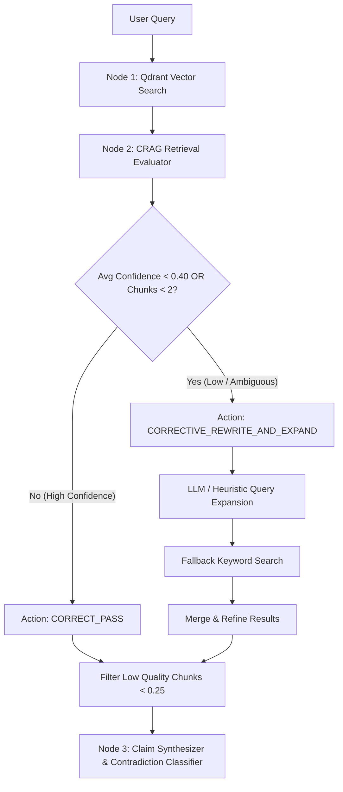

# Corrective Retrieval-Augmented Generation (CRAG) Architecture

The **Omni-Perspective Engine** incorporates **Corrective Retrieval-Augmented Generation (CRAG)** to guarantee retrieval quality and accuracy when detecting multi-source contradictions across news outlets.

---

## 1. Overview & Purpose

Standard RAG pipelines blindly pass vector search results directly to downstream LLMs. In multi-source contradiction detection, this introduces serious flaws:
* **Hallucinations & Noise**: Low-relevance chunks introduce irrelevant text that confuses LLM classifiers.
* **Retrieval Gaps & Acronym Misses**: Financial queries with acronyms (e.g. `CPI`, `PCE`, `Fed rate cuts`) fail under strict vector similarity if source articles spell them out (e.g., *Consumer Price Index*).

**CRAG solves this by inserting a dynamic evaluation & self-correction loop** between Vector Retrieval (Qdrant) and Multi-Claim Synthesis (LangGraph).



---

## 2. Core Components of CRAG

The CRAG agent is implemented in [`backend/app/agents/crag.py`](file:///c:/Users/omm%20prakash/OneDrive/Desktop/rag%20projrct/backend/app/agents/crag.py).

### 2.1 Retrieval Evaluator (`_score_chunk_relevance`)
Every raw chunk retrieved from Qdrant is evaluated using a combined scoring formula combining **dense vector similarity** and **lexical term overlap**:

$$\text{Combined Score} = (0.4 \times \text{Vector Cosine Score}) + (0.6 \times \text{Term Match Ratio})$$

* **Vector Score**: Semantic relevance computed via Gemini embeddings.
* **Term Match Ratio**: Proportion of non-stopword query tokens present in the title and raw excerpt.

### 2.2 Quality Filtering & Thresholds
* **Noise Rejection Cutoff ($\ge 0.25$)**: Any chunk scoring below `0.25` is immediately discarded as noise to prevent dilution of synthesis context.
* **Confidence Trigger Threshold ($< 0.40$)**: If the average relevance score of all chunks drops below `0.40` or fewer than 2 valid chunks are found, CRAG triggers a **Corrective Query Expansion**.

---

## 3. Corrective Action Workflows

### Action A: `CORRECT_PASS`
Triggered when retrieval confidence is high ($\ge 0.40$). Chunks are cleaned, sorted by `crag_score` descending, and forwarded directly to the synthesizer.

### Action B: `CORRECTIVE_REWRITE_AND_EXPAND`
Triggered when initial vector retrieval yields low-relevance or sparse results.
1. **LLM Query Rewriter (Gemini 3.5 Flash)**:
   Rewrites and expands the query to include financial indicator definitions and synonyms:
   > *Example*: `"US CPI metrics"` $\rightarrow$ `"Consumer Price Index inflation rate BLS annualized headline core CPI"`
2. **Heuristic Dictionary Fallback**:
   If the LLM is rate-limited or unavailable, a deterministic financial lookup expands key acronyms:
   * `cpi` $\rightarrow$ `Consumer Price Index inflation rate BLS`
   * `pce` $\rightarrow$ `Personal Consumption Expenditures price index BEA`
   * `fed` $\rightarrow$ `Federal Reserve benchmark interest rate FOMC`
   * `gdp` $\rightarrow$ `Gross Product annualized economic growth rate`
3. **Fallback Retrieval**:
   Executes secondary BM25/keyword search in Qdrant with the expanded query and merges unique chunks back into the evaluation candidate pool.

---

## 4. Pipeline Integration (LangGraph)

As shown in [`backend/app/agents/pipeline.py`](file:///c:/Users/omm%20prakash/OneDrive/Desktop/rag%20projrct/backend/app/agents/pipeline.py), CRAG operates as **Node 2** in the execution graph:

```python
# 1. Vector Search
raw_vector_results = run_vector_agent(query, top_k=top_k)

# 2. CRAG Evaluation & Correction
vector_results, crag_metrics = run_crag_agent(query, raw_vector_results)

# 3. Downstream Synthesis
candidate_groups = run_synthesizer_agent(query, vector_results, graph_results)
contradictions = run_classifier_agent(candidate_groups)
```

---

## 5. Summary of CRAG Execution Metrics

The CRAG agent outputs structured telemetry for real-time WebSocket streaming:

| Metric Field | Description | Example Value |
| :--- | :--- | :--- |
| `action` | Evaluator decision | `CORRECTIVE_REWRITE_AND_EXPAND` |
| `avg_relevance` | Average confidence score across candidates | `0.38` |
| `raw_count` | Chunks prior to CRAG filtering | `10` |
| `refined_count` | High-quality chunks delivered to downstream agents | `6` |
| `confidence` | System confidence status | `CORRECTED` |
