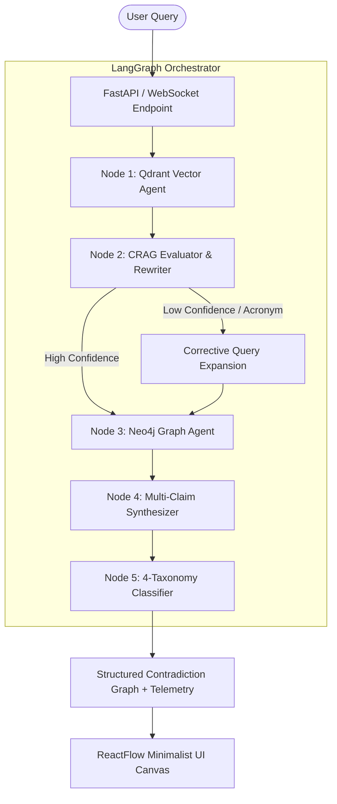

<div align="center">

# ◈ Omni-Perspective Engine

**Real-Time Multi-Source Contradiction Detection Engine Powered by Corrective RAG (CRAG) & Knowledge Graphs**

[](https://fastapi.tiangolo.com/)
[](https://reactflow.dev/)
[](https://www.langchain.com/langgraph)
[](https://qdrant.tech/)
[](https://ai.google.dev/)
[](#license)

<p align="center">
  <a href="#-key-features">Key Features</a> •
  <a href="#%EF%B8%8F-architecture">Architecture</a> •
  <a href="#-corrective-rag-crag">Corrective RAG</a> •
  <a href="#-tech-stack">Tech Stack</a> •
  <a href="#-getting-started">Getting Started</a> •
  <a href="#-api-endpoints">API Reference</a>
</p>

---

</div>

## 📌 Overview

When major financial news outlets (e.g., Bloomberg, Reuters, WSJ) report on economic data, inflation rates, or earnings, their metrics, methodologies, and timeframes often **conflict**. Standard AI search tools hallucinate or blur these differences into a single generic answer.

The **Omni-Perspective Engine** solves this by analyzing multiple news sources simultaneously, extracting fine-grained claims, evaluating retrieval confidence via **Corrective RAG (CRAG)**, and classifying contradictions into a strict 4-type taxonomy.

---

## ✨ Key Features

* ⚔️ **Multi-Source Contradiction Detection**: Automatically extracts and compares conflicting claims across disparate news articles.
* 🔄 **Self-Correcting RAG (CRAG)**: Evaluates vector search confidence in real time. Automatically rewrites queries and expands financial acronyms (`CPI`, `PCE`, `Fed rates`) when retrieval quality is low or noisy.
* 🏷️ **4-Category Contradiction Taxonomy**:
  * `Direct Contradiction`: Opposing numerical values reported for identical metrics and timeframes.
  * `Methodology Mismatch`: Differing metrics (e.g., Headline Inflation vs. Core PCE).
  * `Scope Mismatch`: Different geographical or temporal coverage.
  * `Superceded / Stale`: Outdated reports superceded by newer releases.
* 🕸️ **Interactive Graph Visualizer**: Built with ReactFlow, featuring a minimal 2-color semantic palette (Teal for entities, Coral for live conflicts), drag-and-drop nodes, and sliding contradiction detail inspection.
* ⚡ **Streaming WebSocket Telemetry**: Real-time progress updates delivered stage-by-stage as the agentic pipeline processes queries.

---

## 🏗️ Architecture



---

## 🔬 Corrective RAG (CRAG)

The engine implements the **Corrective RAG (CRAG)** pattern to eliminate noise and retrieval gaps:

1. **Retrieval Evaluator**: Calculates a hybrid relevance score combining vector cosine similarity ($0.4$) and exact term overlap ($0.6$):
   $$\text{Score} = (0.4 \times \text{Vector Similarity}) + (0.6 \times \text{Term Overlap})$$
2. **Noise Filtering**: Automatically drops irrelevant chunks scoring below `0.25`.
3. **Corrective Query Expansion**: If average confidence is below `0.40`, an LLM agent expands acronyms and financial terms before executing secondary keyword fallback search.

> 📄 Read the full CRAG technical documentation in [CRAG_EXPLANATION.md](file:///c:/Users/omm%20prakash/OneDrive/Desktop/rag%20projrct/CRAG_EXPLANATION.md).

---

## 🛠️ Tech Stack

| Domain | Technology | Description |
| :--- | :--- | :--- |
| **Backend Framework** | FastAPI (Python 3.10+) | Asynchronous REST & WebSocket API server |
| **Agentic Framework** | LangGraph / LangChain | Multi-agent graph pipeline orchestration |
| **Vector Store** | Qdrant | Local embedded vector database for semantic chunk retrieval |
| **Graph Database** | Neo4j (Optional) | Knowledge graph engine for entity-relationship traversal |
| **LLM & Embeddings** | Gemini 3.5 Flash / `gemini-embedding-001` | Claim extraction, query expansion, and classification |
| **Frontend UI** | React 18, ReactFlow (`@xyflow/react`), Zustand | Interactive visual graph canvas and state management |
| **Styling System** | Vanilla CSS / Tailored Palette | Minimalist dark UI adhering to strict 7-rule aesthetic design |

---

## 🚀 Getting Started

### Prerequisites

* **Python 3.10+** installed
* **Node.js 18+** & `npm` installed
* **Google Gemini API Key** (Free tier available at [Google AI Studio](https://aistudio.google.com/apikey))

---

### 1. Clone the Repository

```bash
git clone https://github.com/YOUR_USERNAME/omni-perspective-engine.git
cd omni-perspective-engine
```

---

### 2. Configure Environment Variables

Copy `.env.example` to `backend/.env` and add your Gemini API Key:

```bash
cp backend/.env.example backend/.env
```

Edit `backend/.env`:
```env
GEMINI_API_KEY=your_gemini_api_key_here
LLM_MODEL=gemini-3.5-flash
EMBEDDING_MODEL=models/gemini-embedding-001
```

---

### 3. Install Backend Dependencies

```bash
cd backend
pip install -r requirements.txt
cd ..
```

---

### 4. Install Frontend Dependencies (Optional for React Dev)

```bash
cd frontend-react
npm install
cd ..
```

---

### 5. Run the Server

Start the backend API server from the root directory:

```bash
python main.py
```

The application will start at **`http://localhost:8000`**:
* 🌐 **Web UI Application**: `http://localhost:8000/`
* 🏥 **Health Status Endpoint**: `http://localhost:8000/health`
* 📚 **Interactive Swagger API Docs**: `http://localhost:8000/docs`

---

## 🔌 API Reference

| Endpoint | Method | Description |
| :--- | :--- | :--- |
| `GET /health` | `GET` | Health check & database connection status |
| `POST /api/query` | `POST` | Process query through CRAG pipeline and return contradiction graph |
| `WS /ws/query` | `WebSocket` | Real-time streaming WebSocket endpoint with progress telemetry |
| `POST /api/ingest/run` | `POST` | Trigger manual news ingestion pipeline |

### Example REST Request

```bash
curl -X POST "http://localhost:8000/api/query" \
     -H "Content-Type: application/json" \
     -d '{"query": "US inflation rate BLS vs Reuters", "top_k": 10}'
```

---

## 📂 Project Structure

```
omni-perspective-engine/
├── backend/
│   ├── app/
│   │   ├── agents/          # LangGraph agents (Vector, CRAG, Classifier, Synthesizer)
│   │   ├── routers/         # FastAPI endpoints (query, ingest, ws)
│   │   ├── services/        # Ingestion, Qdrant store, extraction logic
│   │   ├── database.py      # SQLite / Neo4j / Redis initializers
│   │   └── config.py        # Environment settings validator
│   ├── main.py              # Backend FastAPI application entrypoint
│   ├── requirements.txt     # Python dependencies
│   └── .env.example         # Environment template
├── frontend/                # Static Web Application UI
├── frontend-react/          # ReactFlow Interactive Graph Application (TypeScript)
│   ├── src/
│   │   ├── components/      # OmniGraph canvas, EntityNode, ClaimNode, ContradictionEdge
│   │   ├── store/           # Zustand graph store
│   │   └── services/        # API and WebSocket streaming services
│   └── package.json
├── CRAG_EXPLANATION.md      # In-depth technical guide on CRAG architecture
├── OMNI_PERSPECTIVE_ENGINE.md # Engine specification & roadmap
├── .gitignore               # Strict git ignore definitions
├── main.py                  # Root entrypoint delegating to backend
└── README.md                # Project documentation
```

---

## 📜 License

Distributed under the **MIT License**. See `LICENSE` for more information.

---

<div align="center">
  <sub>Built with ❤️ using LangGraph, Qdrant, FastAPI, and ReactFlow</sub>
</div>
